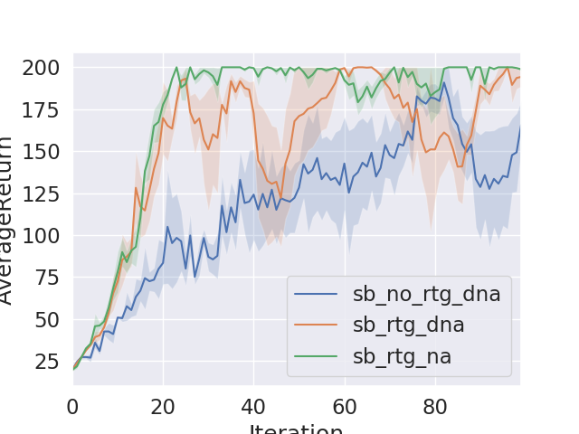

# CS294-112 HW 2: Policy Gradient

Dependencies:

-   Python **3.5**
-   Numpy version **1.14.5**
-   TensorFlow version **1.10.5**
-   MuJoCo version **1.50** and mujoco-py **1.50.1.56**
-   OpenAI Gym version **0.10.5**
-   seaborn
-   Box2D==**2.3.2**

Before doing anything, first replace `gym/envs/box2d/lunar_lander.py` with the provided `lunar_lander.py` file.

The only file that you need to look at is `train_pg_f18.py`, which you will implement.

See the [HW2 PDF](http://rail.eecs.berkeley.edu/deeprlcourse/static/homeworks/hw2.pdf) for further instructions.

# Answers to Homework Experiments

## Problem 4 (CartPole)

### Summary

The benchmark included running multiple experiments with tuning parameters like using [rewards to go, monte carlo rewards], [advantage normalization, no advantage normalization], [large batch size, small batch size]. Then number of iterations were 100 per experiment and each configuration were experimented 3 times to understand variance as well. Below are general observations:

-   Convergence: using reward to go resulted into faster convergence than monte carlo reward
-   Variance: the following parameters helped reducing the variance: increasing batch size and advantage normalization

### Plots




### Answers

Q1- Which gradient estimator has better performance without advantage-centering—the trajectory-centric one, or the one using reward-to-go?

> The reward to go is better because it has lower variance.

Q2- Did advantage centering help?

> Yes it did help reduce the variance and speed up convergence a bit

Q3- Did the batch size make an impact?

> Yes it did, larger batch sizes result in lower variance and low bias

## Problem 5

### Summary

The command below is used to get the fig

```bash
python3 train_pg_f18.py InvertedPendulum-v2 -n 100 -b 5000 -e 5 -rtg --exp_name hc_b5000_r0.0111 --learning_rate 1e-2 --n_layers 2 --size 16
```


